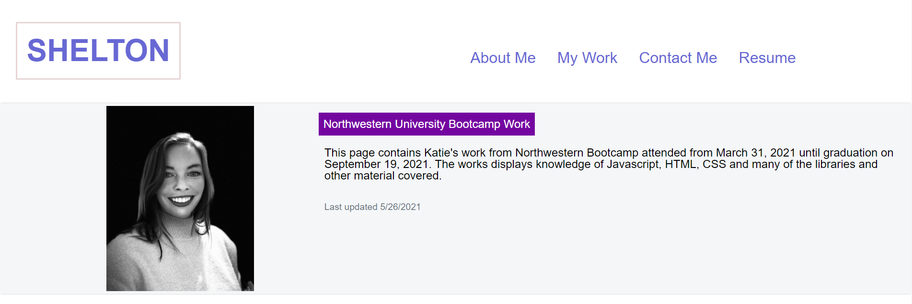
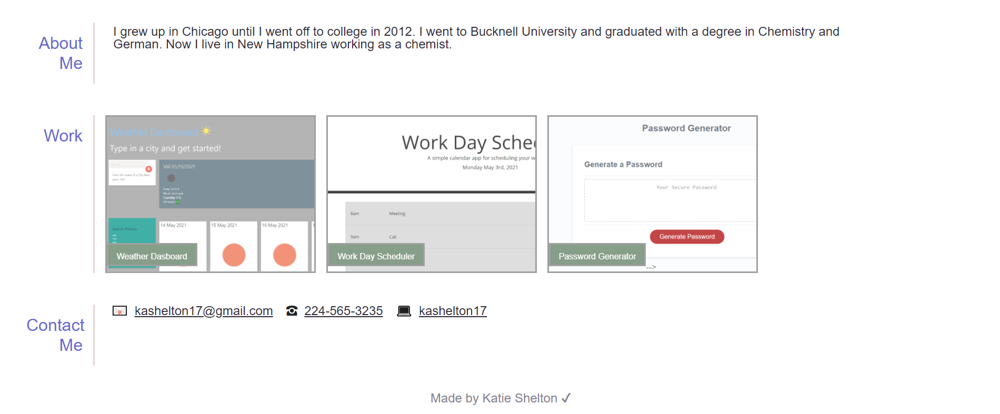

# 07-hw-portfolio-update

This page is the updated version of my portfolio. When you click on the nav buttons you are brought to the section of the page that corresponds with the button. If you click on the resume button you are shown a pdf of my resume in a new tab. There is a current picture of me and a section that explains what this page is. 
The about me section shows updated bio, the work section shows updated works that I have done and the contact me section shows updated contact info. 

link to page: https://kashelton17.github.io/07-hw-portfolio-update/

Technologies used: HTML, CSS, Bootstrap v5.0, javascript

License: MIT
Contact info: kashelton17@gmail.com